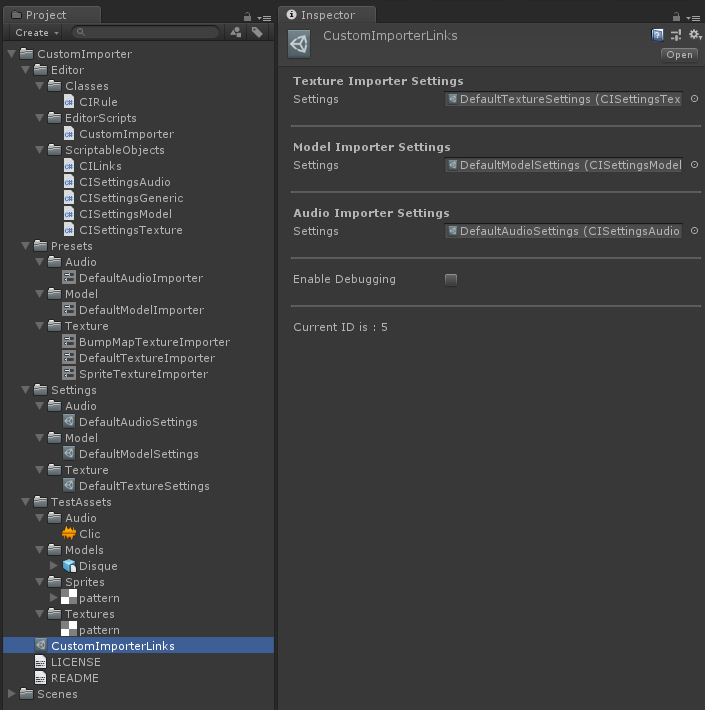

# Custom_Importer
- Made by Atomic Digital Design

This is a package to expand the default importer preset Unity uses to add filtering options

##Disclaimer : This is still a work in progress
##Works with Unity 2018.1b12

Find UnityPackages [in releases section!](https://github.com/AtomicSoom/Custom_Importer/releases)

##Instructions :

* The custom importer works via a set of rules for each type of importers
	(currently working with textures, audio and models).
	To create a set of rules you go to the "Create" menu of the project view
	and select the type you want.
	

* Each rule is associated with a preset you choose.
	(currently rules include asset name tests and path tests)
	When an asset is imported the rules will be tested one by one
	and the first valid will apply it's settings.
	You can reorder the rules using the button "Sort by priority",
	it will reorder the list from the highest priority to the lowest.
	

* To link a set of rules to the AssetPostProcessor you assign it in "CustomImporterLinks"
	which contains a slot for each asset importer type.
	The presets will be applied automatically on import.
	